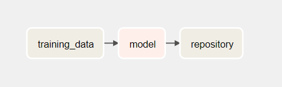
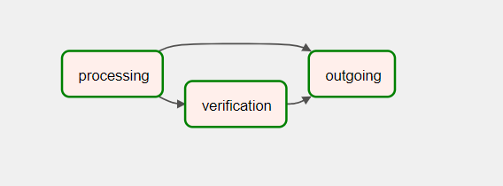
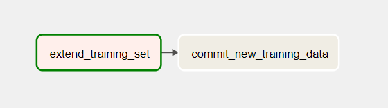

# Project description

This repository contains airflow dags.
But there should be another repository inside: https://github.com/SolomiyaBranets/MLOps - it has all of the data, models and flask application for running the model.

To start airflow run ```docker-compose up```.
To start docker container, that does model training and inference run ```cd MLOps; docker build -t docker-ml-model -f Dockerfile .;  docker-compose up```

Now we can start running pipelines.
Ml pipeline pulles the data with the help of dvc, trains the model, saves it as export.pkl in commits it back:


Data pipeline read an image from data/new_images folder, predicts the breed of an animal, if the predicton probability is not hign enouth this dag copies the file to data/verify folder and then moves the file to data/outgoing folder:


There is another pipeline in the middle, but it's manual: human workers take images from data/verify folder and move them to data/verified folder while renaming the image with the proper breed if needed.

And the last pipeline is retraining. It takes all the images from the data/verified folder, gives them proper names, suitable for training and moves them to the folder where the training data is located. Than it commits the changes with dvc and git:

